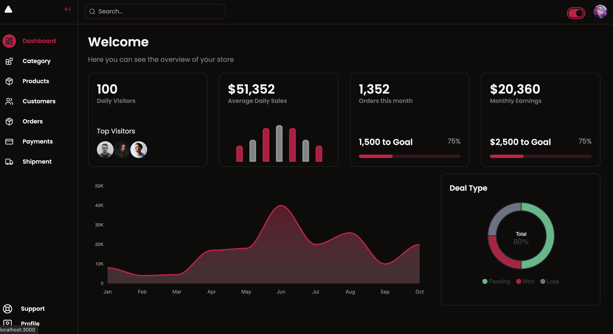
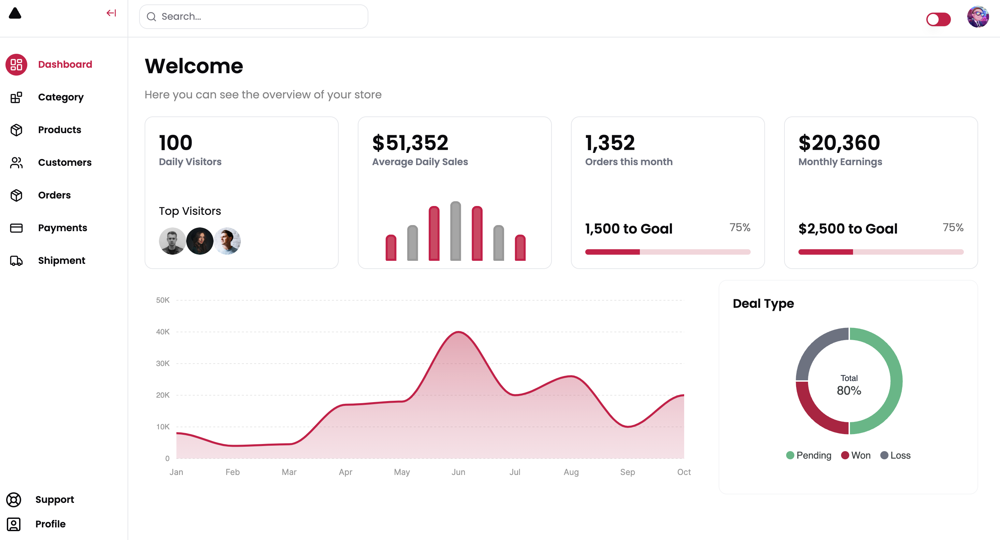

## Getting Started

```bash
# Install dependencies
npm install

# Run the development server
npm run dev
# or
yarn dev
# or
pnpm dev
```


Open [http://localhost:3000](http://localhost:3000) with your browser to see the result.


## Admin UI





